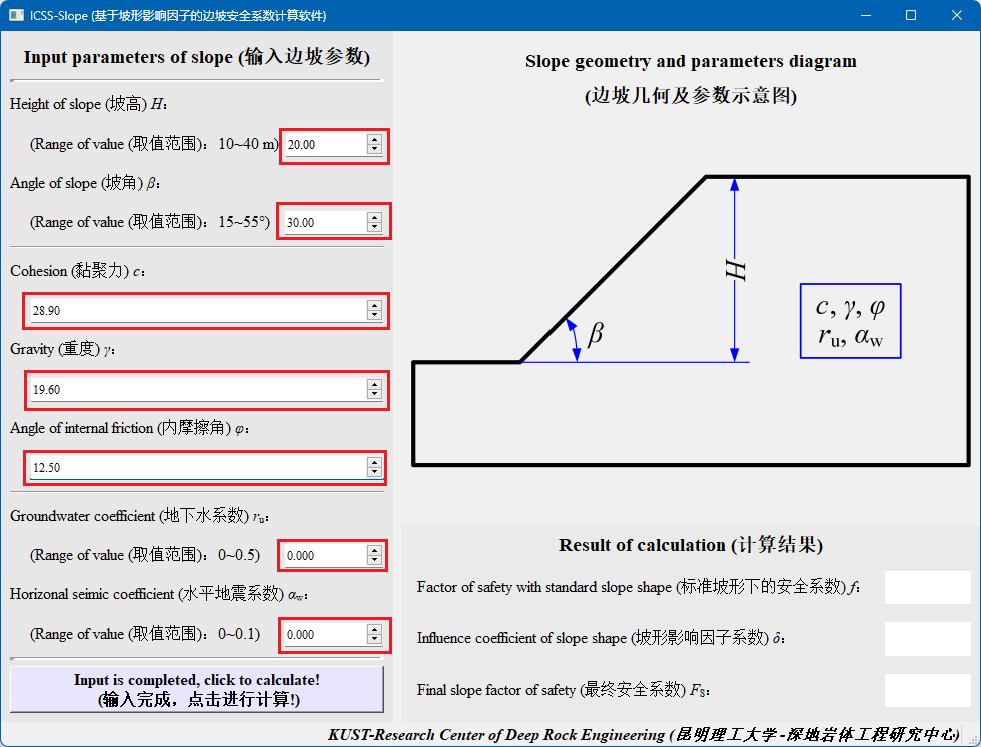
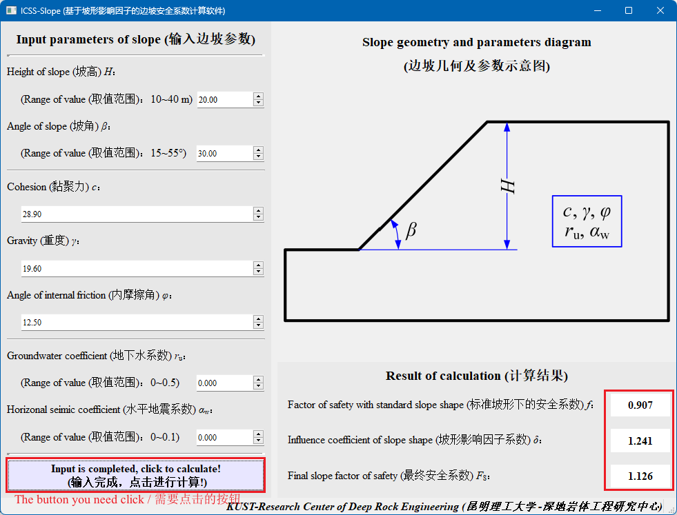

# Soft of the paper *The problem of slope stability is discussed from the perspective of slope size*/ 论文《从坡形尺寸角度探讨边坡稳定性问题》 配套软件

> This software is written according to the paper ***The problem of slope stability is discussed from the perspective of slope size***, and the detailed calculation process is referred to the paper.
>
> 本软件根据论文 ***The problem of slope stability is discussed from the perspective of slope size (从坡形尺寸角度探讨边坡稳定性问题)***编写，详细的计算过程请查阅该论文。
>
> Note: The title of the paper may change later.
>
> 注：论文标题后期可能发生变化

## 0 Linear Interpolation / 线性插值法

如下图所示，存在点 $(x_0,\ y_0)$ 和点 $(x_1,\ y_1)$ 以及待求点的横坐标 $x$，则可用下式计算待求点的纵坐标 $y$：
$$
y=\frac{y_1-y_0}{x_1-x_0}\times(x-x_0) + y_0
$$

## 1. Input parameters of soft / 软件输入参数

### 1.1 parameters of slope shape / 坡形参数

1. Slope heigh / 坡高 $H$ (`H`)
2. Slope angle / 坡角 $\beta$ (`beta`)

### 1.2 Mechanical parameters / 力学参数

1. Cohesion / 黏聚力 $c$ (`c`)
2. Gravity / 重度 $\gamma$ (`gamma`)
3. Angle of internal friction / 内摩擦角 $\varphi$ (`varphi`)
4. Groundwater coefficient / 地下水系数 $r_{\rm u}$ (`r_u`)
5. Horizontal scanning interval seismic coefficient / 水平地震系数 $\alpha_{\rm w}$ (`alpha_w`)

## 2. Calculate steps / 计算步骤

### 2.1 Step 1 / 步骤 1

$$
f_{\rm x} = \frac {c}{\gamma H}
$$

$$
f_{\rm y} = \tan \varphi
$$

$$
r_{\rm u} = ?
$$

$$
\alpha_{\rm w} = ?
$$

Note: The $f_{\rm x}$ code in Formula (1) is written as`f_x`, and the $f_{\rm y}$ code in Formula (2) is written as `f_y`. 

注：式 (1) 中的 $f_{\rm x}$ 代码写作`f_x`，式 (2) 中的 $f_{\rm y}$ 代码写作`f_y`。

The current safety factor f ('f') can be calculated by the Formulas (1), (2), (3) and (4) combined with the table.

由式 (1)、(2) 、(3) 和 (4) 再结合表和插值法可计算得当前安全系数 $f$ (`f`)。

### 2.2 Step 2 / 步骤 2

$$
H^* = \frac{c}{\gamma \tan \varphi}
$$

$$
H=?
$$

$$
\beta = ?
$$

$$
r_{\rm u} = ?
$$

$$
\alpha_{\rm w} = ?
$$

The slope shape influence factor $\delta$ (`delta`) can be calculated by the Formulas (5), (6), (7), (8) and (9) combined with the table.

由式 (5)、(6)、(7)、(8) 和 (9) 再结合表和插值法可计算坡形影响因子 $\delta$ (`delta`)。

### 2.3 Step 3 / 步骤 3

$$
F_{\rm S} = \delta f
$$

The safety factor $F_{\rm S}$ (`F_S`) can be calculated from Formula (10).

由式 (10) 可以计算安全系数 $F_{\rm S}$ (`F_S`)。

## 3. The structure of software / 软件结构

**The structure of software is following / 软件结构如下：**

ICSS-Slope

- main.py

- Readme.md

- calc_func_files

    - calc_delta_from_H.py
    
    - calc_delta_from_H_star.py
    
    - calc_delta_from_r_u_alpha_w.py
    
    - calc_delta_func.py
    
    - calc_f_func.py
    
    - calc_F_s_func.py
    
    - check_paras_func.py
    
    - \_\_init\_\_.py
    
- para_files

    - alpha_w=0.05.xlsx
    
    - alpha_w=0.10.xlsx
    
    - f_calc_paras.xlsx
    
    - r_u=0,alpha_w=0.xlsx
    
    - r_u=0.25.xlsx
    
    - r_u=0.50.xlsx
    
    - \_\_init\_\_.py
    
- rec_files

    - MainWindow.ui
    
    - MainWindow_ui.py
    
    - main_window_class.py
    
    - model.png
    
    - rec.qrc
    
    - rec_rc.py
    
    - \_\_init\_\_.py

## 4. How to use the ICSS-Slope software / 如何使用 ICSS-Slope 软件

1. As shown in the following figure, the correct parameters are input into the corresponding position. / 如下图所示，将正确的参数输入对应位置。

   

2. As shown in the following figure, click the button to calculate, you can get the results. / 如下图所示，点击按钮进行计算，即可得出结果。

   

## 5. Project environment / 运行环境
Python version \ Python 版本: Python 3.8.19
|python package | version|
|-|-|
|colorama | 0.4.6|
|et-xmlfile | 1.1.0|
|numpy | 1.24.4|
|openpyxl | 3.1.2|
|pandas | 2.0.3|
|pip | 23.3.1|
|PyQt5 | 5.15.10|
|PyQt5-Qt5 | 5.15.2|
|PyQt5-sip | 12.13.0|
|python-dateutil 2.9.0.post0|
|pytz | 2024.1|
|setuptools | 68.2.2|
|six | 1.16.0|
|tzdata | 2024.1|
|wheel | 0.41.2|

